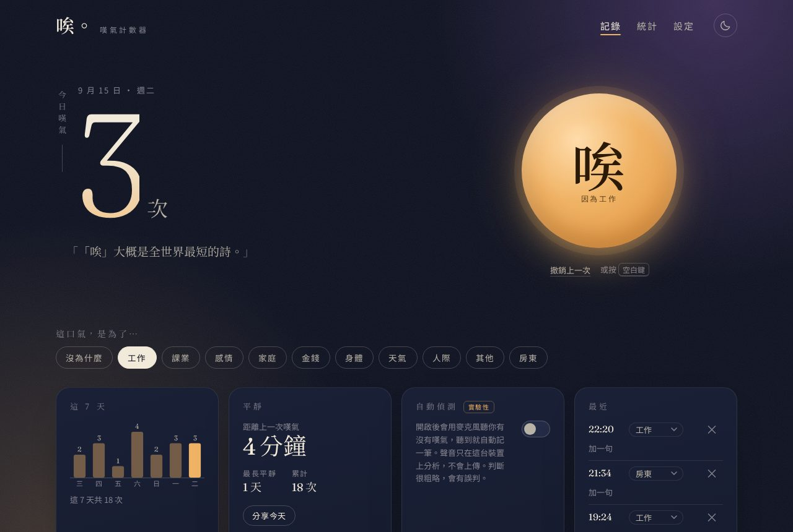
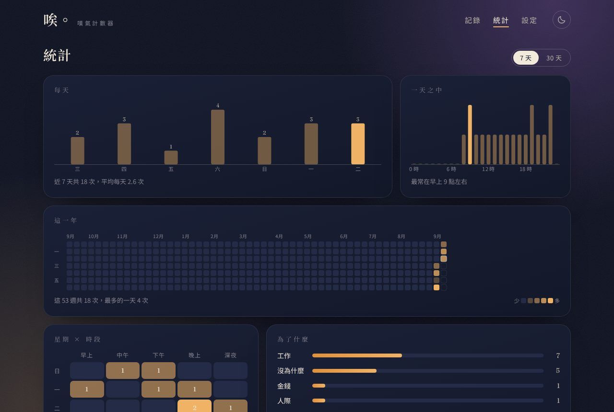
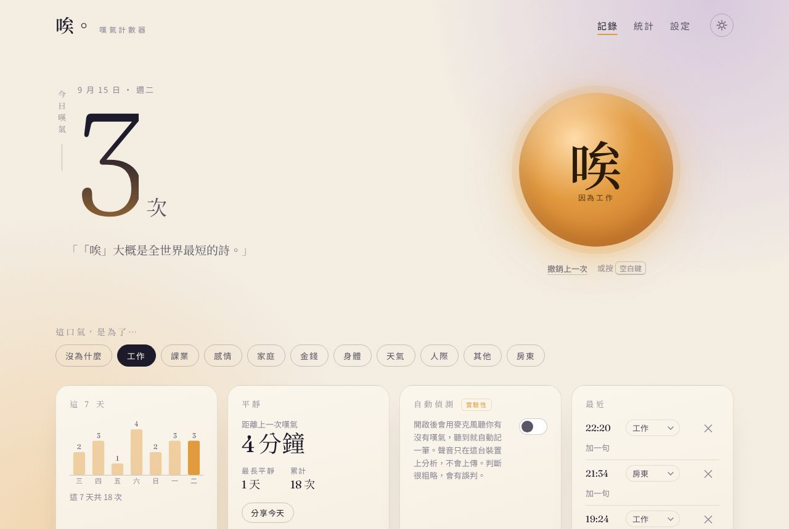

# 唉。嘆氣計數器

> 記下每一聲「唉」，看看自己什麼時候、為了什麼而嘆氣。資料只存在你的裝置裡。



線上版：**https://chung223.github.io/ah/**（合併到 `main` 後由 GitHub Actions 自動部署，見下方「部署」）

## 功能

- **一顆大按鈕**：嘆氣的時候按一下。桌機也可以按空白鍵。按錯了可以撤銷，或在「最近」清單裡刪掉。
- **原因標記**：工作、課業、感情、家庭、金錢、身體、天氣、人際、其他，或「沒為什麼」。選一次會一直套用到之後的紀錄，事後也能在清單裡改。
- **今天的數字**：今日次數、這 7 天、距離上一次嘆氣多久、最長平靜時間、累計。
- **統計**：每天（7 天 / 30 天）、一天之中 24 小時的分布、原因比例、幾個紀錄，以及「觀察」：由資料組出來的幾句話（例如「你最常在下午 3 點左右嘆氣」、「這 7 天比前 7 天少嘆了 4 次」）。
- **自動偵測（實驗性）**：開啟麥克風，聽到像嘆氣的聲音就自動記一筆。聲音只在裝置上分析，不會上傳。判斷很粗略，會有誤判，所以預設關閉。
- **嘆完氣會有一句話**：安靜、有點幽默、不說教。累積到 1、10、50、100、500、1000 次會有里程碑訊息。
- **深色 / 淺色主題**、可選的吐氣音效（用 Web Audio 合成，沒有音檔）、「分享今天」。
- **PWA**：可以加到手機主畫面當作 App，離線也能開。
- **一句話筆記**：每筆嘆氣可以補一句「客戶又改需求」，統計頁的「筆記」卡可以搜尋回顧。記錄後的提示也能直接「撤銷」或「加一句」。
- **週報、月報、年度回顧**：都做成 1080 × 1350 的圖卡，可以分享或存下來。週報看最近 7 天；月報有整月的每日長條、和上個月的比較、前三名原因，可以往前翻到有紀錄的每一個月；年度回顧是 Spotify Wrapped 式的幾句話：「最常在星期一的下午」「最常因為工作，佔 38%」「最忙的一天」「最平靜的一段：連續 N 天沒嘆氣」。
- **這一年**：GitHub 貢獻牆式的熱力圖，一格一天；再加「星期 × 時段」熱區表，一眼看出哪段時間最常嘆氣。
- **自訂標籤**：新增、改名、刪除自己的原因，也能調整全部標籤的順序。
- **照時段自動選原因**：例如上班時間預設「工作」、深夜預設「沒為什麼」；臨時手動改的會維持到下一個時段。
- **深呼吸引導**：一小時內嘆超過 5 次，會邀請你跟著一顆會呼吸的圓做一分鐘（吸 4 秒、停 2 秒、吐 6 秒，五輪）。
- **麥克風校正**：「先對我嘆三次」，用你自己的聲音調整偵測門檻。
- **App 圖示顯示今日次數**：加到主畫面後，圖示右上角顯示今天嘆了幾次（可關）。
- **跨裝置同步**：把紀錄存到你自己的 GitHub 私密 Gist，手機和電腦共用同一份；不經過任何第三方伺服器。
- **長按＝長嘆**：按鈕長按半秒記成「長嘆」，飄出來的字也更長；桌機用 Shift＋空白鍵。統計會另外數長嘆。
- **昨天的你**：每天第一次打開，先看一張昨天的回顧：幾次、最常的原因、多半在哪個時段、寫過的筆記。
- **連續天數**：「連續沒嘆氣」與「連續記錄」幾天，在平靜卡和紀錄裡。
- **清除可復原**：清除全部之後 24 小時內可以一鍵復原（有開同步的話，復原時會以本機為準覆蓋雲端）。
- **新版本提示**：部署新版後，App 會跳「新版本已就緒」，點一下就更新。
- **捷徑直接寫入**：開了同步之後，iPhone 捷徑可以不開瀏覽器就記一筆（見下方）。
- **資料是你的**：只存在瀏覽器的 localStorage。可以匯出 JSON / CSV、匯入合併（同一時間的紀錄不會重複）、一鍵清除。



## 手機怎麼用

最簡單的用法：**加到主畫面，打開，按一下。**

- iPhone：用 Safari 打開網址 → 分享 → 加入主畫面。
- Android：用 Chrome 打開 → 選單 → 加到主畫面（或「安裝」）。

不想每次打開 App 再按，可以用**快速記錄網址**：

```
https://chung223.github.io/ah/?sigh=1
```

打開就直接記一筆並顯示「記錄了，今天第 N 次」。`?sigh=work` 可以帶原因（代號見下方「資料格式」）。網址在 App 的「設定」頁也找得到，有一鍵複製。

- iPhone：捷徑 App → 新增捷徑 → 加入「開啟 URL」動作、貼上網址 → 取名「嘆氣」。之後可以「嘿 Siri，嘆氣」，或在 設定 → 輔助使用 → 觸控 → 輕點背面 綁這個捷徑（有動作按鈕的機型也可以綁）。
- Android：長按已安裝的 App 圖示會有「記一次嘆氣」；或把這個網址另外加到主畫面當成第二顆圖示。

用快速網址記錄時，會出現一個全螢幕的「記錄了 · 今天第 N 次」畫面，可以直接撤銷或關閉。

iPhone 請注意：主畫面 App 和 Safari 的紀錄是分開存的。想用捷徑（Siri、輕點背面）記錄，統計就用 Safari 看，加書籤就好，不要再加到主畫面；想用主畫面 App，就在 App 裡按按鈕。Android 的 Chrome 和已安裝的 App 共用同一份資料，沒有這個問題。開了「跨裝置同步」的話，兩邊也會自動合成同一份。

## 跨裝置同步

沒有伺服器也能同步：App 直接把紀錄存到你 GitHub 帳號下的一個私密 Gist（檔名 `ah-sigh-counter.json`）。

1. 到 [GitHub → Settings → Developer settings → Fine-grained tokens](https://github.com/settings/personal-access-tokens/new) 建一個 token，Account permissions 裡把 **Gists** 設成 Read and write，其他都不用。
2. 打開 App 的「設定 → 跨裝置同步」，貼上 token，按「連線」。
3. 另一台裝置貼同一個 token，就會抓到同一個 Gist。

同步規則：紀錄以時間戳取聯集；刪除會透過「墓碑」傳到另一邊，不會又長回來；筆記不會被空的蓋掉；標籤以代號合併，名稱與順序以本機為準。每次改動後幾秒會自動同步，也可以「立即同步」。

token 只存在你這台裝置的瀏覽器裡。它能讀寫你帳號的所有 Gist，所以請用只給 Gist 權限的 fine-grained token，不要用有 repo 權限的。

### 捷徑直接寫入，不開瀏覽器

同步開好之後，捷徑只要對你的 Gist **留一則留言**，App 下次打開（或同步）時就會把留言變成一筆紀錄，然後把留言刪掉。留言不用先讀再寫，所以一個 HTTP 請求就好；兩台裝置同時處理也不會重複（時間以留言建立時間為準）。

捷徑 App → 新增捷徑 → 「取得 URL 內容」：

| 欄位 | 值 |
| --- | --- |
| URL | `https://api.github.com/gists/<你的 Gist ID>/comments`（App 的設定頁有一鍵複製） |
| 方法 | POST |
| 標頭 `Authorization` | `Bearer <你的 token>`（設定頁有「複製 token」） |
| 標頭 `Accept` | `application/vnd.github+json` |
| 要求本文（JSON） | 欄位 `body`，值 `唉`；`唉 工作` 會帶原因，`唉 工作 客戶又改需求` 後面那段變成筆記 |

做好後到 設定 → 輔助使用 → 觸控 → 輕點背面 綁這個捷徑，或直接用 Siri 叫它的名字。設定頁的「送一筆測試」可以驗證整條路有沒有通。

同步卡下方會顯示診斷：目前 App 版本、上次同步的結果、收件匣看到幾則留言與收進幾筆、讀不到留言時的錯誤。頁尾也有版本號，可以和最新的 commit 對照；新版部署後，App 下次打開會自動套用（正在打字時改為提示）。

## 設計

方向是「黃昏日記」：深藍夜色配一盞琥珀色的燈。標題與語錄用思源宋體（Noto Serif TC），數字用 Fraunces，「今日嘆氣」直排。大按鈕會慢慢呼吸；按下去會擴散一圈光、飄出一個「唉」。淺色模式是同一套語言換成暖紙色。



## 技術

純 HTML / CSS / JavaScript（ES modules）。沒有框架、沒有建置步驟、沒有執行期相依套件。

```
index.html               頁面骨架
styles.css               樣式（色票、主題、動畫、響應式）
src/app.js               畫面與事件：唯一會碰 DOM 的模組
src/stats.js             統計、洞察、熱力圖資料、週報摘要、時間格式化（純函式）
src/storage.js           資料結構、正規化、localStorage、匯入匯出（純函式）
src/reasons.js           內建與自訂原因標籤：排序、改名、刪除（純函式）
src/detector.js          麥克風嘆氣偵測：classifyEvent、校正 profileFromSamples（純函式）＋ SighListener
src/sync.js              GitHub Gist 同步：mergeData（純函式）＋ Gist 客戶端
src/breath.js            深呼吸引導：建議條件與計時（純函式）
src/report.js            週報 canvas 繪圖
src/quick.js             快速記錄網址
src/quotes.js            語錄、里程碑
src/sound.js             吐氣音效合成
sw.js                    Service Worker（離線快取）
manifest.webmanifest     PWA 設定
icons/                   圖示（SVG 原檔與輸出的 PNG）
test/                    單元測試（node --test）
scripts/serve.js         開發用靜態伺服器
.github/workflows/       GitHub Pages 部署
```

### 嘆氣是怎麼「聽」出來的

`SighListener` 用 `AnalyserNode` 每 40 ms 取一次音量（RMS）與頻譜，維持一個會慢慢跟著環境走的噪音地板；音量超過地板一段門檻就開始記錄一段「事件」，安靜下來後交給 `classifyEvent` 判斷：

1. **長度** 0.45 ~ 4.5 秒。太短是敲桌子，太長是講話或音樂。
2. **波形** 高峰在前 60%，之後漸弱，只有一兩個起伏。講話會有很多音節起伏。
3. **頻譜平坦度** 吐氣是氣音、接近雜訊，平坦度高；說話和哼歌有音高，平坦度低。

「靈敏度」同時調整音量門檻與平坦度門檻。按「用我的聲音校正」、對著麥克風自然嘆三次，`profileFromSamples` 會用這三段的平坦度、長度與音量算出你的門檻，之後靈敏度只做小幅微調。

### 資料格式

```json
{
  "app": "ah-sigh-counter",
  "v": 2,
  "exportedAt": "2026-09-15T14:20:00",
  "sighs": [
    { "t": 1789456800000, "r": "work", "n": "客戶又改需求" },
    { "t": 1789460400000, "r": null, "a": 1 }
  ],
  "customReasons": [{ "id": "c_k3x9q2", "label": "房東" }]
}
```

`t` 是毫秒時間戳，`r` 是原因代號（`null` 代表沒為什麼；`c_` 開頭是自訂標籤），`n` 是筆記，`a: 1` 代表麥克風自動偵測，`i: 2` 代表長嘆，`s: 1` 代表由捷徑寫入。舊版（v1）的匯出檔也能匯入。

## 本機執行

```bash
npm start        # http://localhost:8080
npm test         # 執行 test/ 裡的單元測試
```

或用任何靜態伺服器（例如 `python3 -m http.server 8080`）。因為是 ES modules，直接用 `file://` 開不行。

## 部署到 GitHub Pages

網站在 https://chung223.github.io/ah/ ，從 `gh-pages` 分支發布。

每次 push 到 `main`，`.github/workflows/deploy.yml` 會先跑測試，通過後把網站檔案（`index.html`、`styles.css`、`sw.js`、`manifest.webmanifest`、`icons/`、`src/`）推到 `gh-pages` 分支，GitHub Pages 幾十秒內就會更新。也可以在 Actions 頁面手動觸發。

發布時會把 `sw.js` 裡的 `VERSION` 換成該次 commit 的編號，所以每次更新都會建立新的離線快取、清掉舊的；使用者下次打開就是新版。

如果哪天 Pages 被關掉了，到 **Settings → Pages → Build and deployment → Source** 選 **Deploy from a branch → gh-pages / (root)** 即可。

## 隱私

沒有帳號、沒有伺服器、沒有分析追蹤。唯一的外部請求是 Google Fonts 的字型；離線時會退回系統字型。
